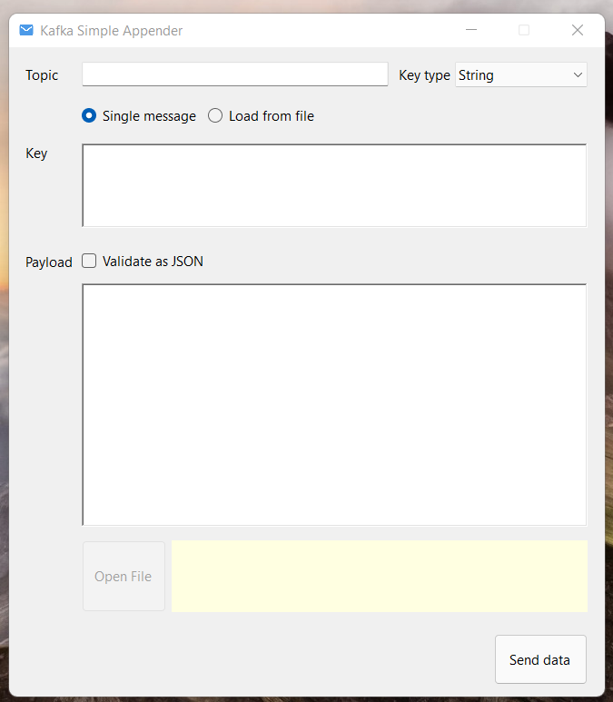

# KafkaSimpleAppender

UI for sending simple messages to Kafka

Current version supports messages with several key types (string, json, long and no key) and string or json payload.



Config example:

```yaml
  "BootstrapConfiguration": {
    "BootstrapServers": [
      "kafka:9092"
    ],
    "Username": "user123",
    "Password": "pwd123",
    "SecurityProtocol": "SaslPlaintext",
    "SASLMechanism": "ScramSha512",
    "MessageMaxBytes": 10000000
  }
```

| Parameter name | Description   |
| -------------- | ------------- |
| BootstrapServers | List of kafka cluster servers, like "kafka-test:9092"  |
| Username | SASL username (optional)  |
| Password | SASL password (optional)  |
| SecurityProtocol | Protocol used to communicate with brokers (Plaintext,Ssl,SaslPlaintext,SaslSsl) (optional)  |
| SASLMechanism | SASL mechanism to use for authentication (Gssapi,Plain,ScramSha256,ScramSha512,OAuthBearer) (optional)  |
| MessageMaxBytes | Maximum Kafka protocol request message size (optional)  |
